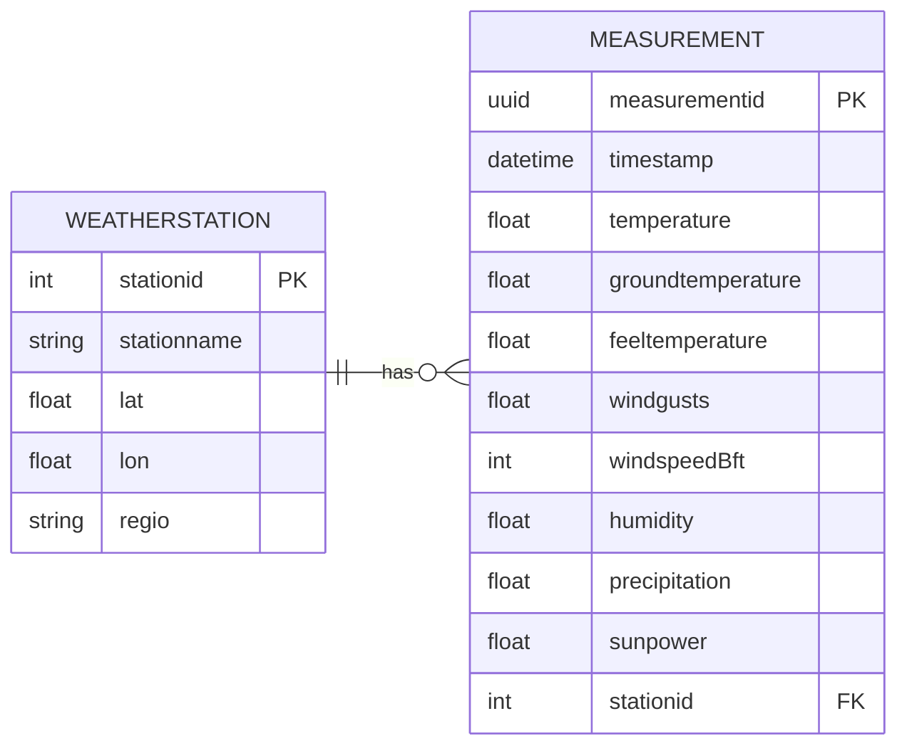

```mermaid
erDiagram
    direction LR
    WEATHERSTATION ||--o{ MEASUREMENT : has
    WEATHERSTATION {
        int stationid PK
        string stationname
        float lat
        float lon
        string regio
    }
    MEASUREMENT {
        uuid measurementid PK
        datetime timestamp
        float temperature
        float groundtemperature
        float feeltemperature
        float windgusts
        int windspeedBft
        float humidity
        float precipitation
        float sunpower
        int stationid FK
    }

```